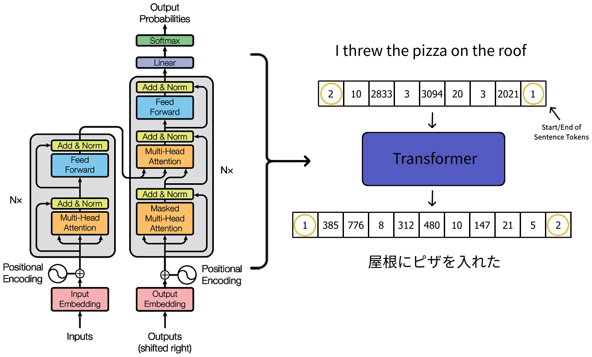

#  Language Translation with Fragment Shaders

### NOTE: This was built and tested with Unity 2019.4.29f1 using built-in render pipeline, there may be shader compatibility issues with other versions.

## Table of Contents
- [Overview](#overview)
- [Problems](#problems)
- [Transformers](#transformers)
- [Setup](#setup)
- [Python, C++ Code](#python-c-code)
- [Resources](#resources)
- [Datasets](#datasets)

## Overview

One of the influential papers in natural language processing is called "[Attention Is All You Need](https://arxiv.org/abs/1706.03762)". This project is a recreation of the Transformer model described in that paper without depending on deep learning libraries like TensorFlow or PyTorch. Specifically built in fragment shaders for VRChat, it will run as fast as your frame rate will allow in VR.

## Problems

- To keep the network simple, the max sentence length is 20 words. Including the special SOS and EOS, start/end of sentence tokens, it's 22.
- This is a very simple implementation of Transformers, it can't handle numbers well. Only remembers what it seen before. For example, it might know 2000 but not 2001.
- The character buffer only holds 80 characters, that's an average of 4 characters per word. So keep the sentences short.
- And of course, this uses cameras which players can't see unless they're your friend in VRChat.

## Transformers

To briefly go over how Transformers work, the input sentence is turned into a sequence of integers. In terms of this English to Japanese translator, every English word has an unique integer representation. And every Japanese character has their own unique integer representation as well on the output side.

These integers are used to fetch a special vector trained to represent each word. Then positional encoding is added to the vector to give it spacial relationship.

The job of the encoder layer is to learn the relation of each word with other words in the input sentence. This is called self attention. The layer can be stacked together multiple times to add complexity.

The job of the decoder layer is to map the relationship the encoder has made with the input sentence and generate a target sentence. For this translator, Japanese is the target.

To generate a Japanese sentence, the decoder layer picks the highest probable Japanese character given the inputs. Then it's added to the end of a string of previous outputs to be fed into the decoder again to generate the next. This loops until an EOS, an end of sentence token, is predicted or the max length is reached.

## Setup

1. Download the latest .unitypackage from [Release](https://github.com/SCRN-VRC/Language-Translation-with-Fragment-Shaders/releases/) and import it.
2. If you cloned the repo, GitHub will not host the large network models.
    - Download [baked-eng2jp.asset](https://mega.nz/file/IFBRUSAY#YOIQMON8gsbIYtjgrE9rfVu0pgFMhCBeSoy5jNrvRUU) and put it inside the `Translator/Eng2Jp/Weights` folder for Unity before you open the Scene.
3. Look in the Prefab folder and add the `TranslatorEng2Jp.prefab` in the world or avatar.
4. Check if the network works in Playmode.

### Python, C++ Code

- Python
    - https://www.tensorflow.org/text/tutorials/transformer
    - My Python code is a copy of the tutorial linked above but modified to spit out intermediate layer outputs and trained with a different dataset. It's better to follow the tutorial linked above than try to run mine.
- C++
    - Windows, for non-Windows platforms remove the Windows.h include.
    - Download [eng2jp_weights.bytes](https://mega.nz/file/QZpUjZrL#eVdAr3nIhjkZIZ8dyhHXHI15Fx24CW9fS84oqMj3sV8) and put it in the same folder as the compiled executable.

## Resources
- [Attention Is All You Need](https://arxiv.org/abs/1706.03762)
- [Transformer model for language understanding](https://www.tensorflow.org/text/tutorials/transformer)
- [Create The Transformer With Tensorflow 2.0](https://trungtran.io/2019/04/29/create-the-transformer-with-tensorflow-2-0/)
- [English to French Translation using ML](https://www.kaggle.com/gauravduttakiit/english-to-french-translation-using-ml)
- [Illustrated Guide to Transformers- Step by Step Explanation](https://towardsdatascience.com/illustrated-guide-to-transformers-step-by-step-explanation-f74876522bc0)

## Datasets
- [Japanese-English Parallel Corpora](http://www.phontron.com/japanese-translation-data.php)
- [eng-jpn parallel corpus from tatoeba.org](http://downloads.tatoeba.org/exports/sentences.tar.bz2)
- [ASPEC (Asian Scientific Paper Excerpt Corpus)](https://jipsti.jst.go.jp/aspec/)
- [Japanese-English Bilingual Corpus of Wikipedia's Kyoto Articles](https://alaginrc.nict.go.jp/WikiCorpus/index_E.html)
- [Web Inventory of Transcribed and Translated Talks](https://wit3.fbk.eu/)
- [JEC Basic Expressions](https://nlp.ist.i.kyoto-u.ac.jp/index.php?%E6%97%A5%E8%8B%B1%E4%B8%AD%E5%9F%BA%E6%9C%AC%E6%96%87%E3%83%87%E3%83%BC%E3%82%BF)

Thanks to [Merlin](https://twitter.com/MerlinVR_) and [orels1](https://twitter.com/orels1_) for the help.

If you have questions or comments, you can reach me on Discord: SCRN#8008 or Twitter: https://twitter.com/SCRNinVR